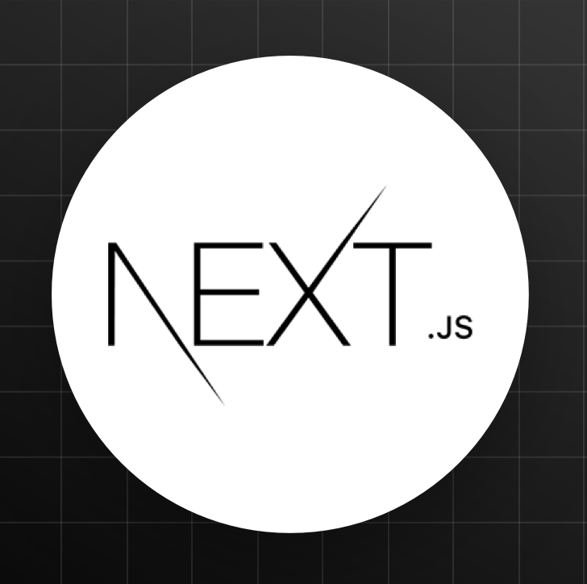

<h2 align="center">🧑🏻‍💻 Technologies and Tools 🧑🏻‍💻</h2>
 

  
  HTML

&nbsp;
&nbsp;

  
  CSS

&nbsp;
&nbsp;

  
  SASS/SCSS

&nbsp;
&nbsp;

  
  Tailwind CSS

&nbsp;
&nbsp;

  
  Ant Design

&nbsp;
&nbsp;

  
  JavaScript

&nbsp;
&nbsp;

  
  Typescript

&nbsp;
&nbsp;

  
  ReactJS

&nbsp;
&nbsp;

  
  Redux

&nbsp;
&nbsp;

  
  NextJS

&nbsp;
&nbsp;

  
  NodeJS

&nbsp;
&nbsp;

  
  NPM

&nbsp;
&nbsp;

  
  Yarn

&nbsp;
&nbsp;

  
  Git

&nbsp;
&nbsp;

  
  Github

&nbsp;
&nbsp;

  
  Gitlab

&nbsp;
&nbsp;

  
  Figma

&nbsp;
&nbsp;

  
  Photoshop

&nbsp;
&nbsp;

  
  Visual Studio Code

&nbsp;
&nbsp;

  
  Jira

&nbsp;
&nbsp;

  
  Slack

 

<h2 align="center">🔎 Where to find me? 🔍</h2>
 
<!-- https://icons8.com -->

  
  
  
  

 

<h2 align="center">✊🏼 My Favorites Quote ✊🏼</h2>
 

